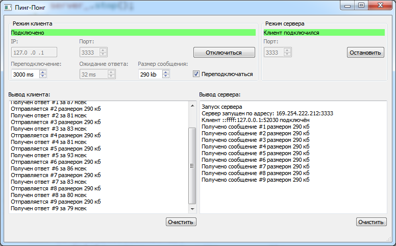

# PingPong
Утилита для проверки работы канала сети

Данная утилита позволяет проверять наличие связи между двумя компьютерами. В отличии от стандартной утилиты **ping.exe**, здесь проверяться можно по конкретным портам и с различным размером передаваемых данных. Тем самым проверяется не только открытость портов через возможные межсетевые экраны или брэндмауеры, но и пропускную способность предоставляемого канала связи.

## Как использовать

Для того, чтобы два экземпляра программы связались друг с другом, необходимо на одной из программ запустить сервер.

### Запуск сервера

Для запуска сервера необходимо в группе элементов интерфейса "Режим сервера" выбрать номер порта, по которому будет работать сервер (поле ввода "Порт") и нажать кнопку "Запустить сервер".

После этого должна появиться надпись "Сервер запущен по адресу *xxxx.xxx.xxx.xxxx:####*".

### Запуск клиента

В другой программе необходимо в группе элементов интерфейса "Режим клиента" указать IP-адрес и порт запущенного сервера, а после нажать на кнопку "Подключиться".

* Параметр "Переподключение" устанавливает время ожидания подключения, по окончании которого соединение считается неуспешным.
* Параметр "Размер сообщения" позволяет управлять размером отправляемых данных.
